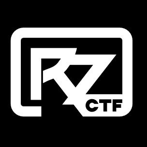

# RingZer0CTF-Forensics-Writeups
This repository contains my writeups for several **RingZer0CTF Forensics challenges**.  
Each writeup explains the investigation process, tools used, and how the flag was recovered.

These challenges helped me practice real **Digital Forensics techniques** such as:

- Disk Analysis
- File Carving
- Metadata Analysis
- Hidden Data Discovery
- Password Cracking

---

